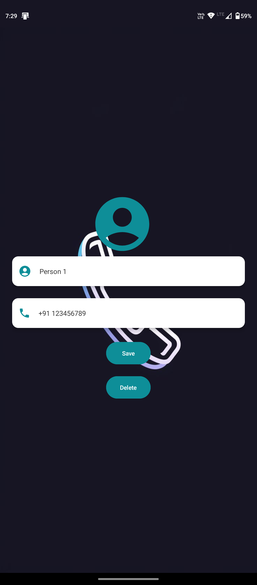

# Phonebook App 📞

**A simple, user-friendly phonebook Android application** that enables users to manage their contacts efficiently. The app provides essential features like adding, editing, deleting, and searching contacts, along with automatic alphabetical sorting for a streamlined user experience.

## Features 🚀

- **Add New Contacts**: Save contact details with a name and phone number.
- **Edit & Delete Contacts**: Update or remove existing contacts as needed.
- **Search Contacts**: Quickly find contacts by typing a name.
- **Alphabetical Ordering**: Contacts are automatically sorted alphabetically, ignoring case, for easy navigation.
- **Duplicate Prevention**: Ensures no duplicate contacts are added.

## Getting Started 📲

1. **Download the APK**: [Download PhonebookApp.apk](https://github.com/your-username/PhonebookApp/releases/download/v1.0/PhonebookApp.apk)
2. **Install the App**:
   - Open the downloaded APK file on your Android device.
   - If prompted, enable “Install from unknown sources” in your device settings.
   - Follow the on-screen instructions to complete the installation.

<h2>Screenshots 📸</h2>

<h3>Splash Screen</h3>

<h3>Home Screen</h3>

<h3>Add Contact Screen</h3>

<h3>Home Screen With Contacts </h3>

<h3>Edit Contact Screen</h3>

## Tech Stack 🛠️

- **Programming Language**: Java
- **Database**: SQLite
- **Platform**: Android

## Usage Instructions

1. **Adding a Contact**:
   - Click on the "Add" button, enter a name and phone number, and save.
   - If a contact with the same name exists, the app will notify you.
   
2. **Editing or Deleting a Contact**:
   - Select an existing contact to edit or delete its details.
   
3. **Searching a Contact**:
   - Type the name in the search bar to quickly locate a contact.

## Project Structure

- **DatabaseHelper.java**: Handles database operations like adding, updating, deleting, and retrieving contacts.
- **MainActivity.java**: The main interface displaying the list of contacts.
- **AddEditContactActivity.java**: Provides the interface for adding or editing a contact.

## Developer 📜
Anubhav Kumar Sah
